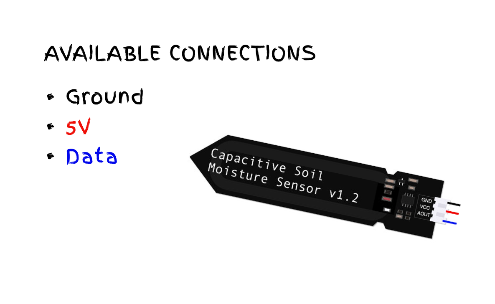

# What is a Moisture sensor? 🤔

A moisture sensor let the Arduino detect moisture

```text
Moisture : water or other liquid diffused in a small quantity as vapour, within a solid, or condensed on a surface.
```

We need this type of sensor to decide whether or not the cyberplant needs to be watered. If the moisture level reach low levels, the plant must be capable to "call" the watering system and set that level to the optimal percentage.

# Setting up the sensor 

The sensor has three pin connectors, one for the 5V pin, other one for ground connection and the last one to output collected data to the Arduino.



We need to connect the red wire to the 5V connection in the Arduino board, ground connection to GND connection and Data connection.


## Checking MAX and MIN values

This type of sensors aren't the most precise tool in this world so, we need to know how to calculate moisture percent, to do so, we need to make use of a glass of water and the following code

```c++   
    #define SERIAL_PORT 9600
    #define MOISURE_SENSOR_PIN A0

    void setup() {
        Serial.begin(SERIAL_PORT);
    }

    void loop() {
        int sensorValue = analogRead(MOISURE_SENSOR_PIN);
        Serial.print("Read : ");
        Serial.println(sensorValue);
    }
```


Get the idle value for the sensor save it, then put the sensor on the glass of water and get the max value.

Well, now we have the MIN and MAX values for our specific sensors.


# Keep reading
[0. Index](../README.md)

[1. Next chapter](./02_CircuitSetup.md)