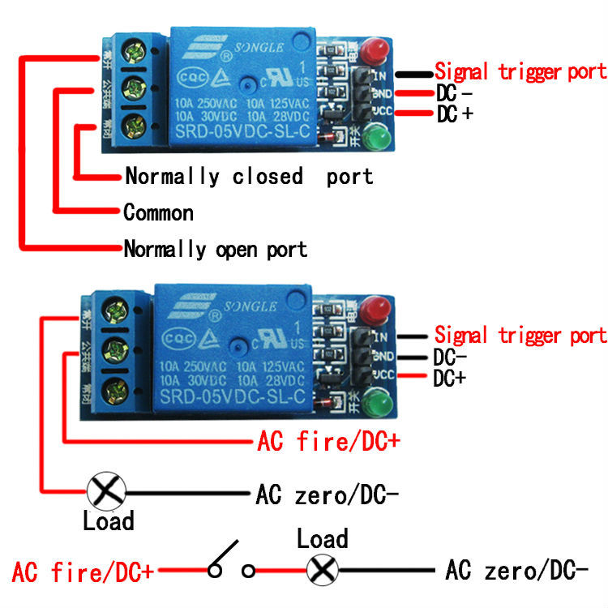

# Setting up the circuit 🪛

Hardware design and prototype has a magic ritual called "wiring", you put cables on places and then two different things can happen, you release the magic smoke or everything works as expected.

We are on the wiring stage now, so we need to put everything together. Lucky for us, we have already setup the moisture sensor.

# What the fuck is a relay?

This circuit have a component called Relay. Wikipedia has a concise meaning for that

```text
A relay is an electrically operated switch. It consists of a set of input terminals for a single or multiple control signals, and a set of operating contact terminals. The switch may have any number of contacts in multiple contact forms, such as make contacts, break contacts, or combinations thereof. 
```

Soooo... It is indeed an electrical switch. The arduino "calls" the Relay so it "calls" the pump to water the plant, easy.

The relay has multiple connections, so let break down real quick.



//TODO chapter finish