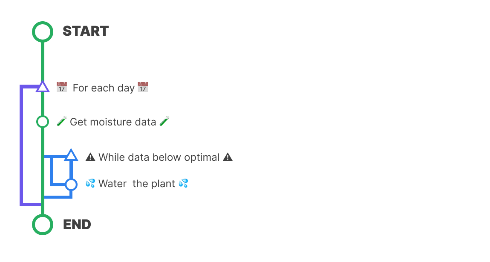

# Let's figure out the code 🧠

The hardware is important for sure, but no hardware works without a good software controlling all the stuff coming in.

First of all we need to think of the steps our program must follow in order to keep the Cyberplant alive.

```text
Making a bit of research, we need to get the humidity percent (%) that our plant needs at least to keep living healthy.   

In my case, that was the 40% of humidity.
```

# Steps 



Let's break down the steps the program must follow to understand them. First of all, this is an early version of the program so we don't need it to be fancy or outstanding. 

Our program runs once a day, it gets data from our sensor and then pumps water to the Cyberplant while the data is below optimal levels. 

Arduino programs run in a loop from power up to power down, that's why we need to **delay that action** to make something periodically.


The code for that is written in [this script](../code/01_Cyberplant/01_Cyberplant.ino)


# Keep reading
[ < Last page](./02_CircuitSetup.md)
&nbsp;&nbsp;
[Index](../README.md)
&nbsp;&nbsp;
[Next page >](./04_conclusion.md)